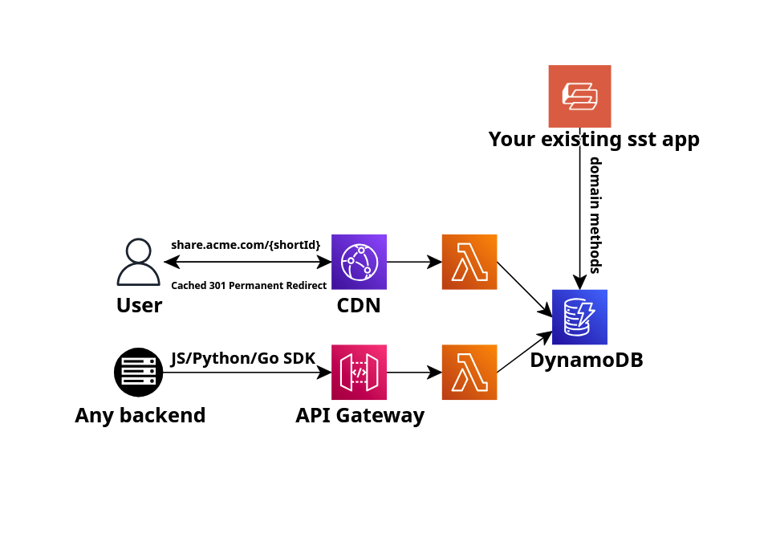

# :hocho: sst-url-shortener

[](https://npmjs.org/package/@dizzzmas/sst-url-shortener) 

Host your own URL shortener on AWS with [SST](https://github.com/sst/sst) and chop up those beefy links in a breeze!

- :twisted_rightwards_arrows: Add as a component to your existing SST app or deploy standalone and integrate with your [JS](https://github.com/Dizzzmas/sst-url-shortener-js-sdk)/[Python](https://github.com/Dizzzmas/sst-url-shortener-python-sdk)/[Go](https://github.com/Dizzzmas/sst-url-shortener-go-sdk) backend via the OpenAPI sdk
- :lock: Opt-in API bearer auth and Swagger docs UI
- :sparkles: URL search and expiration support
- :house: Bring your custom domain
- :moneybag: Serverless and fully within AWS Free Tier, 0 upfront cost



# Pre-requisites

If this is your first time using SST or deploying to AWS, make sure you have the [AWS credentials](https://sst.dev/docs/iam-credentials/) properly setup

# Quickstart

## Standalone SST app
This is for cases when you can't or don't want to integrate the `URLShortener` component into your existing SST app.
Here we will create a new SST app and use an OpenAPI SDK to integrate with our backend deployed elsewhere.

- Create a new project:
```bash
mkdir my-shortener-app && cd my-shortener-app
npm init -y
```

- Init SST and install the `URLShortener` component:
```bash
npx sst@latest init
npm install @dizzzmas/sst-url-shortener
```

- Declare the URL shortener component in `sst.config.ts`:
```typescript
/// <reference path="./.sst/platform/config.d.ts" />
import { UrlShortener } from "@dizzzmas/sst-url-shortener";

export default $config({
  app(input) {
    return {
      name: "url-shortener",
      removal: input?.stage === "production" ? "retain" : "remove",
      home: "aws",
    };
  },
  async run() {
    const urlShortener = new UrlShortener({})

    return {
      api: urlShortener.api.url,
    }
  },
});
```

- Deploy the app to your personal stage via SST dev mode:
```bash
npx sst dev
```

Notice that our app once deployed returns a URL of an API endpoint.
By default the API doesn't require authentication and has Swagger UI enabled.
We can visit `{api}/ui` to access the swagger UI and test our API.

### Backend integration via OpenAPI SDK
SDKs are available for:

- [JS](https://github.com/Dizzzmas/sst-url-shortener-js-sdk)
- [Python](https://github.com/Dizzzmas/sst-url-shortener-python-sdk)
- [Go](https://github.com/Dizzzmas/sst-url-shortener-go-sdk)

Below is an example of using the JS SDK to shorten a URL:

Install the SDK in your backend project
```bash
npm install @dizzzmas/sst-url-shortener-sdk
```

Use it:
```typescript
import SstURLShortener from '@dizzzmas/sst-url-shortener-sdk';

const client = new SstURLShortener({
  baseURL: "YOUR_API_URL",
  bearerToken: undefined // auth disabled in this example
});

async function main() {
  const newUrl = await client.urls.create({
    originalUrl: "https://sst.dev/docs"
  });
  const shortUrl = newUrl.result.shortUrl;
  console.log(shortUrl);  // the shortened URL

  const urls = await client.urls.search({});
  console.log(urls.result);
}

main();
```

## Add as a component to an existing SST app

Install the component:
```bash
npm install @dizzzmas/sst-url-shortener
```

Modify `sst.config.ts` to include the component:
```typescript
import { UrlShortener } from "@dizzzmas/sst-url-shortener";

async run() {
  // ...your existing components
  const urlShortener = new UrlShortener({});

  // link URL shortener to another component e.g. a lambda function
  const example = new sst.aws.Function("Example", {
    link: [...urlShortener.link],
    handler: "example.handler",
    url: true,
  })
}
```

Inside the `example.ts` Lambda handler:
```typescript
import { ShortUrl } from "@dizzzmas/sst-url-shortener"

export const handler = async () => {
  const { shortUrl } = await ShortUrl.create({
    originalUrl: "https://sst.dev/docs"
  })
  console.log("new short url", shortUrl)

  const searchResult = await ShortUrl.search({})
  console.log("search results", searchResult)

  return shortUrl
}
```
## Component configuration

### Authentication

API bearer authentication is disabled by default and can be enabled via setting `enableApiAuth` to `true` on the component.
```typescript
const shortener = new UrlShortener({
  enableApiAuth: true,
})
```
Make sure you specify the Bearer token expected by the API for authentication.

The Bearer token can be set via `UrlShortenerApiAuthKey` SST [Secret](https://sst.dev/docs/component/secret/) and defaults to `your_secret`
```bash
# set the secret
npx sst secret set UrlShortenerApiAuthKey "YOUR_TOKEN"
```

### Swagger UI

Swagger UI is enabled by default and can be disabled via settings `enableOpenApiDocs` to `false` on the component.

```typescript
const shortener = new UrlShortener({
  enableOpenApiDocs: false,
})
```

### Custom domain

You can specify a custom domain for the URL shortener and its API.
```typescript
const shortener = new UrlShortener({
  domain: {
    name: "share.acme.com",
    dns: sst.aws.dns()
  }
})
```
The above example will results in short URLs looking like `https://share.acme.com/etogiyeu`, and the API looking like `https://api.share.acme.com/ui`

Custom domains work out of the box if you use AWS Route53, Cloudflare or Vercel as your DNS provider, but will require [manual setup](https://sst.dev/docs/custom-domains#manual-setup) for other providers.
Please check out SST [Custom Domains](https://sst.dev/docs/custom-domains) docs for more info.

### Short id length

Short id is the alphanumeric identifier for your URLs generated using [cuid2](https://github.com/paralleldrive/cuid2)
e.g. in `https://share.acme.com/etogiyeu` the short id is `etogiyeu`

Its length can be anywhere from 4 to 24 characters and defaults to 8.
```typescript
const shortener = new UrlShortener({
  shortIdLength: 12
})
```

### Transform underlying resources

You can fully customize the underlying resources thanks to the SST [Transform](https://sst.dev/docs/components/#transform) feature.

```typescript
const shortener = new UrlShortener({
  transform: {
    redirectHandler: {
      function: {
        timeout: 30
      }
    }
  }
})
```

